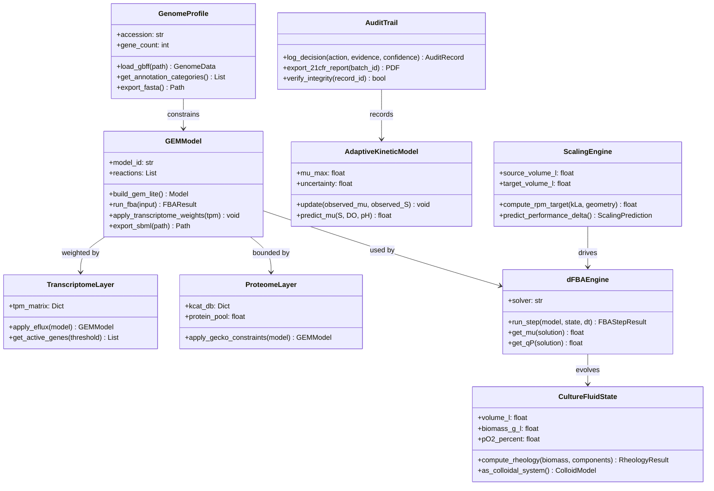
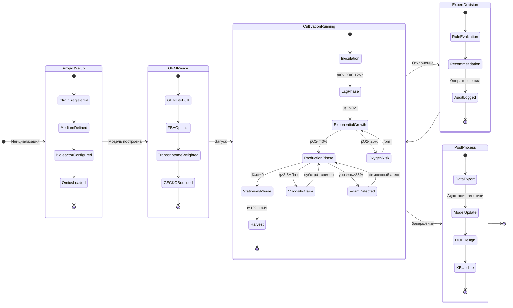
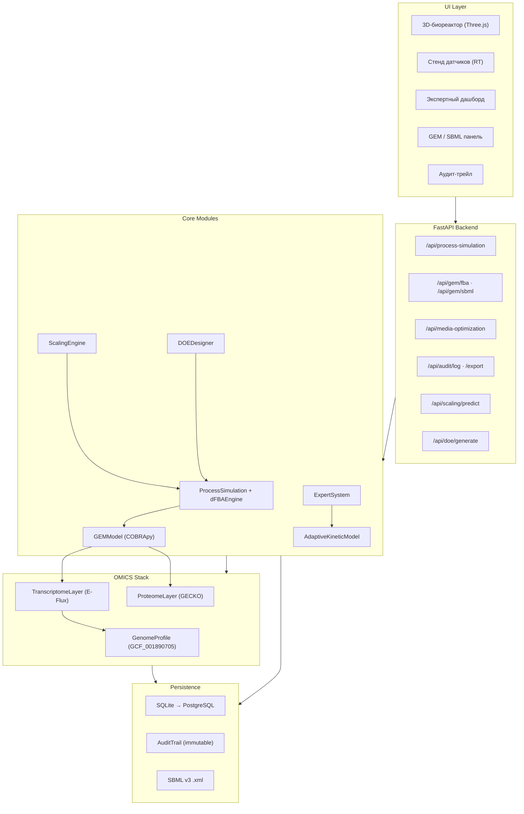
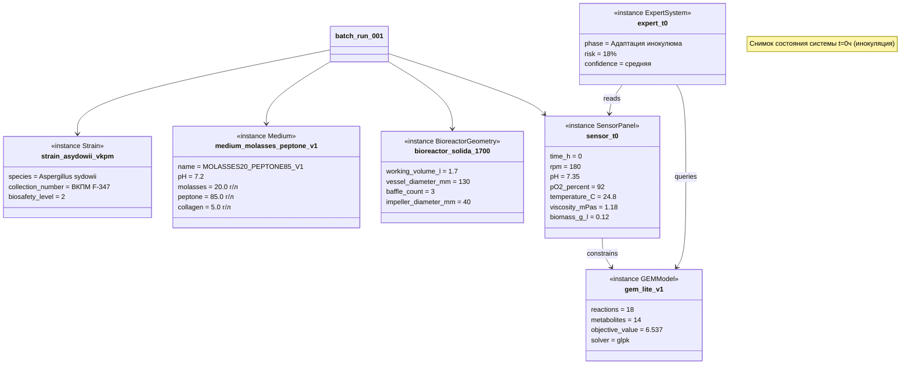
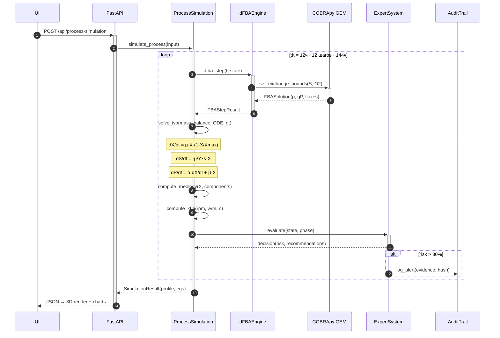
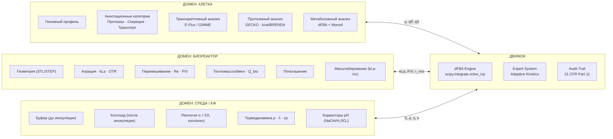

# BioCult-KB v2 — Архитектурный план трансформации

> **Репозиторий:** [myahlovvlad/Cultivation-collagenase](https://github.com/myahlovvlad/Cultivation-collagenase)  
> **Штамм:** *Aspergillus sydowii* ВКПМ F-347 · GCF_001890705.1  
> **Целевой продукт:** Цифровой двойник + аналитическая платформа + система мониторинга  
> **Дата:** 2026-05-27

***

## 1. Аудит текущего состояния репозитория

Проект уже содержит рабочую архитектуру из 13 Python-модулей в `web_app/`:

| Модуль | Размер | Статус | Что делает |
|--------|--------|--------|------------|
| `main.py` | 13.8 КБ | ✅ | FastAPI router, 25 эндпоинтов |
| `gem_cobra.py` | 12.5 КБ | ⚠️ proxy | GEM-lite (18 реакций, 14 метаболитов), proxy-стехиометрия |
| `process_simulation.py` | 7.5 КБ | ⚠️ эмпирическая | dFBA-like цикл, эмпирические μ и qP |
| `system_biology.py` | 20.3 КБ | ✅ | CellularPrograms, геномная оценка |
| `cell_process.py` | 20.2 КБ | ✅ | Оптимизация среды, сценарии DOE |
| `omics_pipeline.py` | 17.3 КБ | ✅ | Scaffold для генома/транскриптома |
| `schemas.py` | 8.8 КБ | ✅ | 30+ Pydantic-моделей |
| `models.py` | 3.7 КБ | ⚠️ минимальная | 7 SQLAlchemy-таблиц, нет AuditTrail |
| `calculations.py` | 2.6 КБ | ⚠️ | KLa, KLa_max — без ODE-KLa |
| `recommendations.py` | 2.8 КБ | ⚠️ | Rule-engine, нет логирования решений |
| `07_models/` | 6 .md | 📄 | Текстовые описания, не Python-код |

**Главные архитектурные долги:**

1. `GEMModel` — proxy-стехиометрия без кураторских генов; GPR отсутствует
2. `process_simulation.py` — кинетика эмпирическая (`mu = 0.006 + 0.060 * capacity_index`), μ не берётся напрямую из FBA через `solve_ivp`
3. `models.py` — нет таблицы `AuditRecord`, нет `CultureFluidState` как персистентного объекта
4. `07_models/` — кинетические уравнения существуют только в Markdown, не имплементированы как Python-классы
5. Нет слоёв: TranscriptomeLayer, ProteomeLayer/GECKO, ScalingEngine, DOEDesigner, pHCorrector, HeatTransferModel, FoamControlModel

***

## 2. Трёхдоменная архитектура v2

Система строится на **строгой декомпозиции трёх доменов**, каждый из которых реализуется как самостоятельный Python-пакет с собственными моделями, вычислительными движками и слоем персистентности. Домены связаны через единый `ProcessEngine` — шину событий с двунаправленной обратной связью.

```
Геном (GEM/SBML)
    ↓ flux constraints (E-Flux, GECKO)
Транскриптом/Протеом (RNA-seq → kcat weights)
    ↓ enzyme abundance → vmax
Метаболом (dFBA: solve_ivp + COBRA step)
    ↓ μ, qP, qS → source terms
Биореактор (ODE: масс-баланс + kLa + реология)
    ↑ локальные [O₂], [S], pH → обратно в GEM
```

### 2.1 Домен «Клетка»

**GenomeProfile** — корневой объект: загружает GBFF, формирует `AnnotationCategory` с весами доказательств для 6 групп генов (протеазы, секреция, транспорт, ЦУМ, вторичный метаболизм, клеточный цикл). В текущей версии `build_genome_report()` в `system_biology.py` выполняет эту функцию, но без формального класса.

**GEMModel** расширяется до полноценной curated GEM через CarveMe на основе аннотированного генома `GCF_001890705.1`. Ключевые добавления к текущим 18 реакциям:
- Секреторный compartment: ER → Golgi → extracellular
- Транспортные реакции для металл-зависимых протеаз (Fe³⁺/Zn²⁺)
- GPR-аннотации для реакций протеазного пула

**TranscriptomeLayer** применяет метод E-Flux или GIMME: TPM-матрица генов из BioProject PRJNA542911 используется как весовые коэффициенты верхних границ потоков в GEM. Ключевые гены мониторинга: семейства S8/M9 протеаз, HSP, PDI, BIP секреторного пути.

**ProteomeLayer (GECKO)** накладывает ограничение белкового пула: \(v_{\max}(rxn) = k_{cat}(enzyme) \cdot [E]\), где \([E]\) оценивается из TPM через линейную регрессию. Данные kcat берутся из BRENDA для гомологов *A. niger*/*A. oryzae*.

### 2.2 Домен «Биореактор»

**BioreactorGeometry** получает параметры из текущего `BioreactorScene` и дополняется:
- Импортом 3D-модели (STL/STEP → Three.js mesh для фронтенда)
- Расчётом числа Рейнольдса: \(Re = \frac{\rho \cdot n \cdot d_{imp}^2}{\mu}\)
- Эмпирическими корреляциями для kLa: \(k_La = C \cdot \left(\frac{P}{V}\right)^{\alpha} \cdot v_s^{\beta}\) (модель Vant Riet)

**AerationModel** заменяет нынешнее эмпирическое `oxygen_fit = clamp(aeration_vvm * 0.48 ...)` на физически обоснованный расчёт OTR/CTR:
\[OTR = k_La \cdot (C_{O_2}^* - C_{O_2})\]
\[CTR = k_La \cdot H_{CO_2} \cdot (p_{CO_2} - p_{CO_2,ref})\]

**HeatTransferModel** добавляет расчёт биотепла и теплового баланса — необходимо для масштабирования и управления рубашкой:
\[Q_{gen} = \Delta H_{rxn} \cdot r_{O_2} \cdot V\]

**FoamControlModel** детектирует пенообразование через сигнал уровнемера и электропроводности, генерирует события `AntifoamEvent` для аудит-трейла.

### 2.3 Домен «Среда / Культуральная жидкость»

До инокуляции питательная среда моделируется как **буферный раствор** — рассчитывается буферная ёмкость \(\beta = \frac{dC_b}{dpH}\) на основе состава. `pHCorrector` вычисляет дозу корректора по Гендерсону-Хассельбалху.

После инокуляции система переходит в **коллоидную модель**: CultureFluidState отслеживает ρ, η, κ как функции биомассы и субстрата — что уже частично реализовано эмпирически в `process_simulation.py`, но нужно вынести в отдельный класс с физическими моделями реологии (степенной закон для мицелиальных суспензий).

***

## 3. Диаграмма классов (UML)

Полная диаграмма содержит 30+ классов, сгруппированных по доменам и слоям. Ключевые новые классы относительно текущего кода:



Полная диаграмма (все 30+ классов) включает также: `BioreactorGeometry`, `SensorPanel`, `AerationModel`, `MixingModel`, `HeatTransferModel`, `FoamControlModel`, `Medium`, `MediumComponent`, `pHCorrector`, `ProcessSimulation`, `ExpertSystem`, `DOEDesigner`, `OmicsPipeline`, `CellularProgram`, `SecretoryPathway`, `BatchRun`, `Observation`, `Strain`, `Rule`.

***

## 4. Диаграмма состояний процесса



Диаграмма состояний отражает **замкнутый цикл знаний**: каждый завершённый батч обновляет `AdaptiveKineticModel`, что улучшает прогноз следующего эксперимента.

***

## 5. Диаграмма компонентов



***

## 6. Диаграмма объектов (снимок t=0ч)

Состояние системы в момент инокуляции согласно данным `BioreactorScene`:



***

## 7. Диаграмма последовательности — dFBA шаг



***

## 8. Трёхдоменная декомпозиция



***

## 9. Критические изменения в коде

### 9.1 Замена эмпирического μ на физический dFBA

**Текущее состояние** — `process_simulation.py`:
```python
# ТЕКУЩИЙ КОД (эмпирический)
mu = (0.006 + 0.060 * capacity_index) * carbon_lim * nitrogen_lim * (0.45 + oxygen_fit * 0.55)
growth = max(0.0, mu * biomass * (1 - biomass / carrying_capacity) * dt)
```

**Цель v2** — физическая dFBA через `scipy.integrate.solve_ivp`:
```python
# ЦЕЛЕВОЙ КОД (dFBA + Monod)
from scipy.integrate import solve_ivp
import cobra

def dfba_ode(t, y, model, params):
    X, S_molasses, S_N, S_collagen, P, DO = y
    Ks_S, Ks_O = params["Ks_S"], params["Ks_O"]

    # Michaelis-Menten uptake constraints → FBA bounds
    q_S_max = params["qS_max"] * S_molasses / (S_molasses + Ks_S)
    q_O2_max = params["qO2_max"] * DO / (DO + Ks_O)
    model.reactions.EX_molasses_proxy_e.lower_bound = -q_S_max * X
    model.reactions.EX_o2_e.lower_bound = -q_O2_max * X

    sol = model.optimize()
    if sol.status != "optimal":
        return * 6
    mu = sol.fluxes["DM_biomass_c"]
    qP = sol.fluxes["EX_collagenolytic_product_e"]
    qS = abs(sol.fluxes["EX_molasses_proxy_e"])
    OUR = abs(sol.fluxes["EX_o2_e"])

    dXdt = mu * X
    dSdt = -qS * X
    dNdt = -params["qN_coeff"] * mu * X
    dCdt = -params["qC_coeff"] * qP * X
    dPdt = qP * X
    dDOdt = params["kLa"] * (params["DO_sat"] - DO) - OUR * X / params["V"]
    return [dXdt, dSdt, dNdt, dCdt, dPdt, dDOdt]
```

### 9.2 Новая таблица AuditTrail

Добавить в `models.py` для соответствия 21 CFR Part 11:
```python
class AuditRecord(Base):
    __tablename__ = "audit_records"
    id = Column(Integer, primary_key=True, index=True)
    timestamp = Column(DateTime, nullable=False, default=datetime.utcnow)
    user = Column(String, nullable=False)
    session_id = Column(String, nullable=False)
    batch_id = Column(Integer, ForeignKey("batch_runs.id"), nullable=True)
    action_type = Column(String, nullable=False)  # alert|decision|param_change
    recommendation = Column(Text, nullable=False)
    evidence_json = Column(Text, nullable=False)  # JSON-строка
    confidence = Column(Float, nullable=True)
    decision = Column(String, nullable=True)       # accepted|rejected|pending
    decision_reason = Column(Text, nullable=True)
    outcome_json = Column(Text, nullable=True)     # заполняется после следующего измерения
    record_hash = Column(String, nullable=False)   # SHA-256 предыдущих полей
```

### 9.3 Новый эндпоинт /api/audit/log

Добавить в `main.py`:
```python
@app.post("/api/audit/log", response_model=schemas.AuditRecordSchema)
def log_audit_event(input_data: schemas.AuditLogInput,
                    db: Session = Depends(get_db)):
    import hashlib, json
    payload = json.dumps(input_data.dict(), sort_keys=True, ensure_ascii=False)
    record_hash = hashlib.sha256(payload.encode()).hexdigest()
    record = models.AuditRecord(
        user=input_data.user,
        session_id=input_data.session_id,
        action_type=input_data.action_type,
        recommendation=input_data.recommendation,
        evidence_json=json.dumps(input_data.evidence),
        confidence=input_data.confidence,
        record_hash=record_hash,
    )
    db.add(record)
    db.commit()
    db.refresh(record)
    return record
```

### 9.4 TranscriptomeLayer (E-Flux)

Новый файл `07_models/transcriptome_constraints.py`:
```python
def apply_eflux_weights(model, tpm_dict: dict, threshold: float = 0.05):
    """Накладывает экспрессионные веса на верхние границы реакций GEM (E-Flux)."""
    max_tpm = max(tpm_dict.values(), default=1.0)
    for rxn in model.reactions:
        gene_ids = [g.id for g in rxn.genes]
        if not gene_ids:
            continue
        expr_vals = [tpm_dict.get(gid, 0.0) for gid in gene_ids]
        weight = min(expr_vals) / max_tpm  # AND-логика (минимум)
        new_ub = rxn.upper_bound * max(weight, threshold)
        rxn.upper_bound = new_ub
    return model
```

### 9.5 Модель реологии (Step-law для мицелиальных суспензий)

Новый файл `07_models/rheology_model.py`:
```python
import numpy as np

def compute_apparent_viscosity(
    biomass_g_l: float,
    collagen_g_l: float,
    shear_rate_s: float = 100.0,
    K0: float = 1.05,
    alpha_X: float = 0.34,
    alpha_C: float = 0.025,
    n: float = 0.82,  # индекс течения (n<1 → псевдопластика)
) -> float:
    """Степенная модель вязкости мицелиальной суспензии [мПа·с]."""
    K_consistency = K0 + alpha_X * biomass_g_l + alpha_C * collagen_g_l
    eta_apparent = K_consistency * (shear_rate_s ** (n - 1)) * 1000
    return eta_apparent
```

***

## 10. Дорожная карта трансформации

| Приоритет | Задача | Файлы/модули | Инструменты | Срок |
|-----------|--------|--------------|-------------|------|
| 🔴 P0 | AuditTrail: таблица + эндпоинты | `models.py`, `main.py`, `schemas.py` | SQLAlchemy, hashlib | 1 неделя |
| 🔴 P0 | Curated GEM через CarveMe | `gem_cobra.py` → `gem_asydowii_v2.xml` | CarveMe, COBRApy | 2–3 недели |
| 🔴 P1 | dFBA через solve_ivp (заменить эмпирику) | `process_simulation.py` → `dfba_engine.py` | SciPy, COBRApy | 2 недели |
| 🟡 P2 | TranscriptomeLayer (E-Flux) | `07_models/transcriptome_constraints.py` | pandas, COBRApy | 1 неделя |
| 🟡 P2 | Модели реологии и kLa (van't Riet) | `07_models/rheology_model.py`, `kla_model.py` | numpy, scipy | 1 неделя |
| 🟡 P3 | pHCorrector + буферная модель среды | `07_models/ph_corrector.py` | scipy.optimize | 1 неделя |
| 🟠 P4 | ProteomeLayer / GECKO | `07_models/gecko_layer.py` | GECKO-py, BRENDA API | 3–4 недели |
| 🟠 P4 | HeatTransferModel + FoamControlModel | `07_models/heat_model.py` | numpy | 1 неделя |
| 🟠 P5 | AdaptiveKineticModel (Bayesian update) | `07_models/adaptive_kinetics.py` | pymc / scipy.stats | 2 недели |
| 🟠 P5 | ScalingEngine (kLa-invariant) | `07_models/scaling_engine.py`, `/api/scaling` | numpy | 1 неделя |
| ⚪ P6 | DOEDesigner + /api/doe/* | `07_models/doe_designer.py` | pyDOE2, scipy | 2 недели |
| ⚪ P7 | 3D-импорт аппаратов (STL/STEP) | `web_app/static/` + Three.js loader | Three.js GLTFLoader | 3 недели |
| ⚪ P8 | Validation pack IQ/OQ/PQ (GAMP5) | `tests/iq_oq_pq/` | pytest | параллельно |

**Критический путь:** P0 (AuditTrail) → P0 (curated GEM) → P1 (dFBA) → P2 (Transcriptome) → P4 (GECKO) → P5 (Adaptive)

***

## 11. Новая структура пакетов

```
BioCult-KB_Aspergillus_sydowii/
├── web_app/
│   ├── main.py                    # FastAPI router
│   ├── models.py                  # + AuditRecord, CultureFluidState
│   ├── schemas.py                 # + AuditLogInput, AuditRecordSchema
│   ├── gem_cobra.py               # → curated GEM v2
│   ├── process_simulation.py      # → dFBAEngine wrapper
│   ├── system_biology.py
│   ├── cell_process.py
│   ├── recommendations.py         # + audit integration
│   ├── omics_pipeline.py
│   └── ...
├── 07_models/                     # Python-модули (не только .md!)
│   ├── dfba_engine.py             # NEW: scipy.solve_ivp + COBRA step
│   ├── transcriptome_constraints.py  # NEW: E-Flux
│   ├── gecko_layer.py             # NEW: GECKO protein pool
│   ├── rheology_model.py          # NEW: power-law viscosity
│   ├── kla_model.py               # NEW: van't Riet correlation
│   ├── ph_corrector.py            # NEW: Henderson-Hasselbalch
│   ├── heat_transfer_model.py     # NEW: Q_bio + Q_jacket
│   ├── foam_control_model.py      # NEW: foam detection
│   ├── adaptive_kinetics.py       # NEW: Bayesian μ_max update
│   ├── scaling_engine.py          # NEW: kLa-invariant scale-up
│   ├── doe_designer.py            # NEW: pyDOE2 wrapper
│   └── *.md                       # Существующие описания
├── tests/
│   ├── test_dfba_engine.py        # OQ: входы → выходы
│   ├── test_gem_v2.py
│   ├── test_audit_trail.py
│   └── iq_oq_pq/                  # GAMP5 validation protocols
└── ...
```

***

## 12. Ключевые архитектурные принципы v2

### Принцип 1: Физическая обоснованность vs эмпирика
Каждое уравнение должно иметь источник (литература, BRENDA, NCBI). Proxy-коэффициенты (`mu = 0.006 + 0.060 * capacity_index`) заменяются Monod-кинетикой с литературными \(K_s\) значениями для *Aspergillus spp*.

### Принцип 2: Разделение ответственности (SRP)
- `dFBAEngine` отвечает только за один FBA-шаг и возврат μ, qP
- `ProcessSimulation` интегрирует ODE, не зная про COBRApy напрямую
- `ExpertSystem` читает состояние, не изменяет его

### Принцип 3: Аудит как первый класс
`AuditRecord` создаётся при каждом вызове `/api/recommend` и при каждом изменении параметра процесса оператором. Запись содержит SHA-256 хэш от набора входных данных + решения — это минимальное требование 21 CFR Part 11.

### Принцип 4: Degraded mode повсюду
Текущий паттерн с `degraded_mode: bool` в `ProcessSimulationResult` правильный — расширить на все модули. Если GECKO недоступен — работаем без него, с предупреждением в AuditRecord.

### Принцип 5: Итеративная замена
Не переписывать всё сразу. Начать с добавления `AuditTrail` + `dfba_engine.py` рядом с существующим кодом, затем переключить `process_simulation.py` на новый движок. Это позволяет сохранить рабочий прототип на всех этапах.

***

## 13. Примечание о Flowsheet-подобном интерфейсе (COMSOL-inspired)

Запрошенный «COMSOL-подобный интерфейс» реализуется на уровне UI через **граф-редактор доменов** (аналог COMSOL Multiphysics Model Builder):

1. **Node graph** (react-flow или vis.js): каждый домен — нод; рёбра — потоки данных (μ, kLa, S)
2. **Граничные условия**: задаются на рёбрах между доменами (например, kLa как граничное условие между «Биореактор» → «Клетка»)
3. **Domain hierarchy**: Cell → Organelle (ER, Golgi) → Reaction; Bioreactor → Zone → Mesh point
4. **Import 3D**: Three.js GLTFLoader для STL/GLTF сосудов; Solida-геометрия уже закодирована в `BioreactorScene`

Техстек: React + Three.js (3D) + react-flow (граф-редактор) + Chart.js/D3 (временные ряды) + FastAPI (бэкенд).